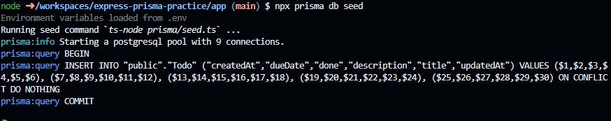

# Express Prisma Practice
- This repo is an example project for my practice that consists of Express, a popular Node.js web app framework, and [Prisma](https://www.prisma.io/), an easy-to-use ORM for Node.js & TypeScript
- The infrastructure is set up by Dev Containers with docker and docker-compose files
  - The settings are based on [my dev container template for Express & Postgres](https://github.com/brklntmhwk/dev-container-express-postgres)
- DB is [PostgreSQL](https://www.postgresql.org/)
- Template engine is [Pug](https://pugjs.org/api/getting-started.html)

## Tips
### Express
#### Hot reload
In a dev container, it doesn't work properly somehow. Probing the cause around a bit, it seems to be related to
~~In collaboration with `nodemon` and `ts-node`, you can achieve hot reload.~~
- 1. Install nodemon and ts-node as dev dependencies
  - Execute `npm install --save-dev ts-node nodemon`
- 2. Create `nodemon.json` and add some configurations
  - See `nodemon.json` for reference
- 3. Add `"dev": "nodemon"` to scripts in `package.json`
Now you can start your app with hot reload functionality by `npm run dev`
---
### Prisma
#### Startup
These steps are based on [Prisma Docs Quickstart](https://www.prisma.io/docs/getting-started/quickstart).
- 1. Execute `npx prisma init`
  - It generates `prisma/schema.prisma` for you, in which you can define your DB relations.
  - If you've already decided which DB to use, executing `npx prisma init --datasource-provider your-db-choice` is more convenient
- 2. Model your data in `schema.prisma`
- 3. Add your DB url to `.env` generated in the step 1
  - See `.env.example` for reference
- 4. Execute `npx prisma migrate dev --name init`
  - It runs a migration for you to create your DB tables you defined
  - It generates `prisma/migrations/{yyyymmddhhmmss_init/migration.sql, migration_lock.toml}`
  - Hereafter you can use a Prisma DB client
  - In dev, `npx prisma db push` is helpful when you want to reflect changes in the schema but not to generate migration folders every time.
#### Seeding data
- 1. Install ts-node as a dev dependency
  - Execute `npm install --save-dev ts-node`
- 2. Add this setting to `package.json`
```json
"prisma": {
    "seed": "ts-node prisma/seed.ts"
},
```
- 3. Create `prisma/seed.ts` and add code for seeding
  - Refer to [Seeding your database](https://www.prisma.io/docs/guides/migrate/seed-database)
- 4. Execute `npx prisma db seed`
  - 

## Reference
### Overall
- [How can I include pug templates in compiled typescript?](https://stackoverflow.com/questions/71751998/how-can-i-include-pug-templates-in-compiled-typescript)
- [TypeScriptのExpressアプリケーションを作る](https://qiita.com/jumperson/items/e546137f6305ea98a673)
- [Express(Node.js)でTypeScript環境を構築するための完全ガイド](https://reffect.co.jp/node-js/express-typescript/)
### Prisma
- [Prisma Docs Quickstart](https://www.prisma.io/docs/getting-started/quickstart)
- [Seeding your database](https://www.prisma.io/docs/guides/migrate/seed-database)
### Styles
- [tailwindlabs/tailwindcss-intellisense](https://github.com/tailwindlabs/tailwindcss-intellisense)
- [How to Fix Tailwind CSS IntelliSense in Visual Studio Code](https://javascript.plainenglish.io/how-to-fix-tailwind-css-intellisense-in-visual-studio-code-3dede794df21)
